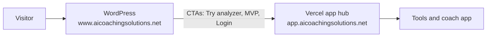

# Game plan — WordPress main site, Vercel apps

## One sentence

**WordPress (`www.aicoachingsolutions.net`) is the main marketing site.**  
**Vercel (`app.aicoachingsolutions.net`) is where apps and tools run.**

Do not build a second full marketing website on Vercel.

---

## Traffic flow



| Step | Where | What they get |
|------|--------|----------------|
| 1 | **WordPress** | Brand story, hero video, coaching tools overview, blog/SEO, “coming soon” for app hub |
| 2 | **Vercel** | Open a tool: Free Swing Analyzer, MVP waitlist pages, Practice Planner app, sign-in |
| 3 | **Vercel `/app`** | Logged-in coach workspace (Clerk) |

WordPress links **out** to Vercel. Vercel links **back** to WordPress only as a small footer line (“full marketing story on aicoachingsolutions.net”), not as a duplicate homepage.

---

## Domains and config

| Role | URL | Code / hosting |
|------|-----|----------------|
| **Main site (marketing)** | `https://www.aicoachingsolutions.net` | WordPress + theme `ai-coaching-solutions` |
| **Apps (product)** | `https://app.aicoachingsolutions.net` | Next.js on Vercel (`C:\ai-coaching-web`) |

**WordPress `wp-config.php`:**

```php
define( 'ACS_MARKETING_SITE_URL', 'https://www.aicoachingsolutions.net' );
define( 'ACS_VERCEL_APP_URL', 'https://app.aicoachingsolutions.net' );
```

**Vercel `.env`:**

```env
NEXT_PUBLIC_MARKETING_SITE_URL=https://www.aicoachingsolutions.net
```

All product CTAs on WordPress use `acs_app_url()` → app subdomain paths (`/free-breakdown`, `/practice-planner`, `/break90`, `/app`, etc.).

---

## What lives where

### WordPress only

- Full homepage (hero, trust bar, tool grid, feature sections, multi-sport, CTAs)
- **“New app website launching soon”** banner (`site-announcement`) — top of homepage
- SEO, blog/posts (if on WP), legal pages on marketing domain
- Long-form MVP story in page sections + `platform-mvp-callout`
- Staging/deploy: upload theme to `wp-content/themes/ai-coaching-solutions/` (see `STAGING-DEPLOY.md` in XAMPP project)

**Local path:** `c:\xampp\htdocs\aicoachingsite\wp-content\themes\ai-coaching-solutions\`  
**Git backup:** `C:\ai-coaching-web\wordpress-theme\ai-coaching-solutions\` (run `scripts/sync-wordpress-theme.ps1` then push)

### Vercel only

- **App hub** home: short “Launch a tool” + cards (`src/app/(marketing)/page.tsx`)
- **Free Swing Analyzer** — `/free-breakdown` (live)
- **MVP program pages** — `/practice-planner`, `/break90` (waitlist + full 60-day Pro copy from `src/lib/mvp-programs.ts`)
- **Coach app** — `/app/*` (Practice Planner, drills, team; Clerk auth)
- APIs (breakdown, contact, etc.)

### Shared (keep wording in sync)

- **60 days Pro free**, founding coach/golfer, up to **120 days** with milestones  
- Canonical copy: `docs/CHAT-HANDOFF-coming-soon-and-pro-copy.md`  
- Vercel long MVP text: `src/lib/mvp-programs.ts` only — do not fork paragraphs in two places without updating both

---

## What not to do

| Don’t | Do instead |
|-------|------------|
| Rebuild the WordPress homepage on Vercel | Keep app hub minimal; link to WordPress |
| Put the homepage “coming soon” banner on Vercel | Banner stays on WordPress only |
| Point `ACS_VERCEL_APP_URL` at `www.aicoachingsolutions.net` | Point at `app.aicoachingsolutions.net` |
| Edit only XAMPP and expect GitHub/Vercel to update | Sync theme folder + push Vercel repo |
| Use different trial lengths (30 vs 90 days) | **60 days Pro** everywhere unless you change the handoff doc |

---

## Deploy checklist

**WordPress (marketing)**  
1. Edit theme locally in XAMPP  
2. `.\scripts\sync-wordpress-theme.ps1` from `C:\ai-coaching-web`  
3. Upload theme OR push `wordpress-theme/` and deploy on host  
4. Bump `ACS_THEME_VERSION` in `functions.php`; hard-refresh  

**Vercel (apps)**  
1. Edit `C:\ai-coaching-web` (repo root `src/`, not only `ai-coaching-solutions-main/` duplicate)  
2. `git push` → Vercel auto-deploys `app.aicoachingsolutions.net`  
3. Confirm env vars on Vercel dashboard  

---

## Cursor workspaces

| Task | Open folder |
|------|-------------|
| Marketing homepage, announcement, SEO | `c:\xampp\htdocs\aicoachingsite` |
| App hub, analyzer, MVP pages, coach app | `C:\ai-coaching-web` |
| Both | Add both folders to one workspace |

---

## Related docs

- `docs/CHAT-HANDOFF-coming-soon-and-pro-copy.md` — exact Pro/MVP strings  
- `docs/brand-alignment.md` — design tokens + file map  
- `wordpress-theme/README.md` — sync WP theme into git  
